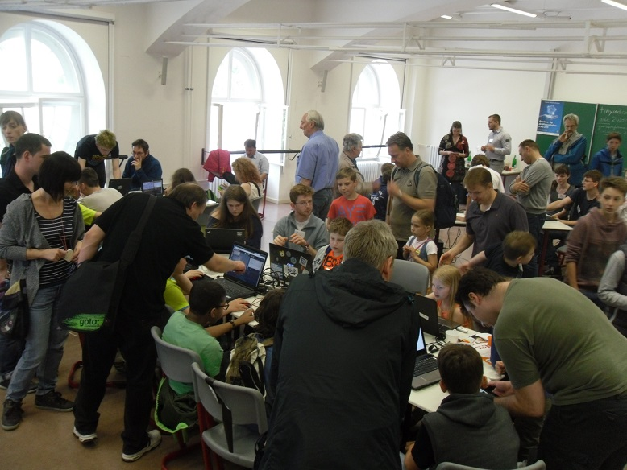

Das Coder Dojo Potsdam beim Tag der Wissenschaften
==================================================

Dieses Mal fand das Coder Dojo Potsdam am Campus am Neuen Palais statt. Es gab viele andere Veranstalungen beim [Potsdamer Tag der Wissenschaften](http://www.potsdamertagderwissenschaften.de/). Hier ein paar Impressionen:

  
  

Da das Coder Dojo hier eher zum kurzen Ausprobieren war und viele sehr junge Teilnehmer da waren, haben wir uns hauptsächlich mit den Programmierrätseln von [code.org](http://code.org) und [Lightbot](https://coderdojo.com/lightbot-coderdojo-edition/) beschäftigt. 

Vielen Dank an die Mentoren Friedrich Schumann, Christoph Sterz, Stefan Gehrmann, Adrian Strehlau, Kirstin Heidler und Nicco Kunzmann.