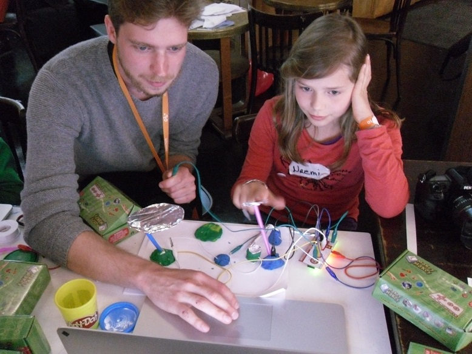

Coder Dojo & Junge Tüftler beim OpenTechSummit
==============================================

Das [Coder Dojo Potsdam](http://zen.coderdojo.com/dojo/861) und [Junge Tüftler](http://junge-tueftler.de/) organisierten zusammen den Kinder-Track beim [OpenTechSummit](http://opentechsummit.net/). 
Ohne die vielen Mentoren wäre das aber garnicht so gut möglich gewesen. 
Viele Dank die Mentoren Hubert Hesse, Ramin Soleymani, Stephan Klinger, Jakob Schade, Fabian Sommer, Christoph Sterz, Elias Lehnert, Christopher Lehnert, Fredi Alexander, Thomas Kumlehn, Mika Kumlehn, Julia Kleeberger, Nicco Kunzmann, Friedrich Schumann, Iwan Gabovitch, Frieder Reuter, Kirsten Genenger, Byung Han Kim, Fabian Bitter, Marianna Poppitz, Franzi Schmid, Fredi Alexander.

Zuerst haben wir mit Programmierrätseln und Spielen wie 
[code.org](http://code.org), 
[blockly](https://blockly-games.appspot.com/?lang=en), 
[LightBot](https://coderdojo.com/lightbot-coderdojo-edition/) und 
[codecombat](http://codecombat.com/) begonnen. 
Die volständige Liste ist [hier](http://tinyurl.com/ots15-kids). 
Diese Spiele führen in die Programmierung ein. 
Da die Teilnehmer sich aussuchen konnten, womit sie sich beschäftigen, 
führten viele ihre Spiele weiter.

  
Es wurde auch mit [Scratch](http://scratch.mit.edu/) begonnen. 
Die drei Levels vom Affen, der Bananen isst, 
kann man sich runterladen und ansehen ([apen_bende](https://github.com/CoderDojoPotsdam/projects/tree/be6940b3346088a3b66ec42353ce62eb0a3d49e0/Scratch%20Projects)). 
Manchmal haben Teilnehmer auch schon vorgriffen und sich mit Arduino-Programmierung beschäftigt.

  
Zwei Teilnehmer haben sich mit dem [Raspberry Pi](http://www.raspberrypi.org/) beschäftigt und eigens dazu Monitore mitgebracht. 
Ihr Ziel war es, mit der Programmiersprache C++ die GPIO-Anschlüsse des kleinen Rechners zu beschalten, 
um eine LED und später auch einen Roboter ansteuern zu können. 
Wer bei [Jugend Hackt](http://jugendhackt.de/) dabei war, 
kannte wahrscheinlich den ein oder anderen.

  
Es ist auch möglich, als junger Mentor teilzunehmen. 
Elias ist etwas mehr als ein halbes Jahr dabei und bringt anderen Python, Java und Arduino bei. 
Mika ist öfter bei Tech-Veranstaltungen in Berlin und war diesmal auch Mentor.

  
Bei der Bastelsession der [Jungen Tüftler](http://junge-tueftler.de/) ist viel Interessantes entstanden: 
Leuchttürme und hier zu sehen ein Schlagzeug mit [MakeyMakey](http://www.makeymakey.com/).

  
Erfreulicher Weise gab es auch einen Löt-Workshop von Mitch nebenan. 
Wer mit dem Arduino eine Schaltung baut, 
konnte so die Verkabelung befestigen oder sich aneignen, wie man mit dem Lötkolben umgeht.

Auf der Konferenz selbst gab es auch was zu sehen. 
Nebenan gab es Installationen und 3d-Drucker. 
Die Teilnehmer des Kids-Spaces konnten sich frei auf der Konferenz bewegen und auch die Vorträge ansehen. 

