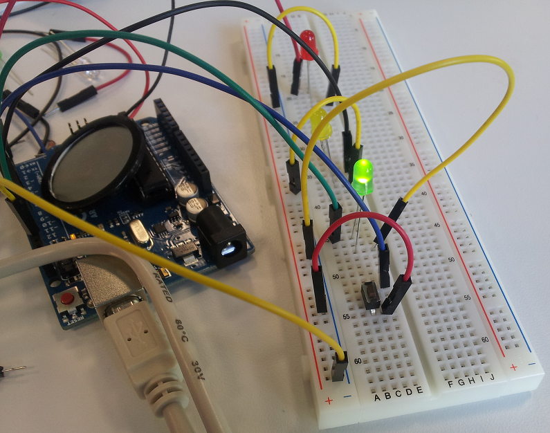

[Das Coder Dojo Potsdam ist da - der Klub traf sich erstmals in Potsdam](http://tinyurl.com/erster-coder-dojo-potsdam)
======================================================================

Coder Dojos sind Klubs für Kinder und Jugendliche, um programmieren zu lernen. Programmieren ermöglicht ihnen Stück für Stück, hinter die digitalen Anwendungen und Apps zu schauen, die sie tagtäglich verwenden. Diesmal hat sich fast die Hälfte der Teilnehmer entschieden, Apps zu bauen.

Die erste Veranstaltung war als Testlauf geplant, um das Interesse abzuschätzen. Am 27.September waren drei Stunden lang ca. 35 Personen dabei. Das Feedback fiel sehr positiv aus. So wünschten sich viele der Teilnehmer, dass das Dojo alle zwei Wochen stattfindet. [Am 11. Oktober ist das nächste geplant.](https://zen.coderdojo.com/dojo/861)

Was passierte da?
----------------

Was die Anwesenden wollten. Nach einer kurzen Vorstellung vom Material, konnten sich die Teilnehmer aussuchen, in welche Richtung sie gehen wollten. Manche haben sich dem [Hour of Code](http://code.org/) Tutorial verschrieben, wo sie Angry Birds auf die Schweine zusteuerten. 

Andere widmeten sich der Entwicklung ihrer eigenen App mit [App Inventor](http://appinventor.mit.edu/). Schon bald meldete sich das erste Tablet und grüßte auf Knopfdruck. Später beschwerte sich ein Smartphone, dass es nicht geschüttelt werden möchte.

Aber man kann Apps auch in Java entwickeln und so sammelte sich eine Gruppe um den Mentor Ralf Teusner, die ohne Tutorial den harten Weg einschlug. Am Ende lief die erste Testapp und die Teilnehmer hatten auf drei verschiedenenn Betriebssystemen die Möglichkeit, zu Hause weiter zu entwickeln.

Apps sind nicht alles. Mit Arduinos von der [Technologiestiftung Berlin](http://www.technologiestiftung-berlin.de/) und der [OpenTechSchool](http://www.opentechschool.org/) entwickelten zwei Teilnehmer eine Ampelsteuerung mit roten, gelben und grünen LEDs. Die Anweisungen and die Ampelsteuerung programmierten sie auf dem Laptop. Diese wurden dann über ein USB-Kabel auf einen kleinen [Arduino](http://fritzing.org/shop/starter-kit/)-Rechner übertragen, der sie befolgte und die LEDs ein und ausschaltete.

Wer will nicht sein eigenes Spiel entwickeln? Mit [Scratch](http://scratch.mit.edu/) bot sich dazu auch die Möglichkeit. Ein Teilnehmer hat sein Spiel erstmal geplant und aufgemalt. Danach hat er mit [Inkscape](http://www.inkscape.org/) das Logo entworfen.

Die [OpenTechSchool](http://www.opentechschool.org/) stellt online auch [ihre Tutorials](http://learn.opentechschool.org/) bereit. So wählten einige Teilnehmer Python als ihre erste Programmiersprache aus. Wie sich herausstellte, waren sie nicht die einzigen. Andere Teilnehmer hatten wohl über den [Programmieranfängerkurs mit Python](https://open.hpi.de/courses/pythonjunior2014) vom Coder Dojo erfahren.

Zwanzig Minuten am Ende nutzten wir, damit die Teilnehmer vorstellen konnten, womit und woran sie sich beschäftigt hatten. So kann man inspiriert mit Vorfreude und Plänen nach Hause gehen.

Wie kam es zum Coder Dojo?
--------------------------

Mein Name ist Nicco Kunzmann und ich habe das erste Coder Dojo Potsdam mit organisiert. Früher habe ich schon mit der [OpentechSchool](http://www.opentechschool.org/) und [HacKIDemia](http://www.hackidemia.com/) beim ersten [Berliner Kids Hackathon](http://www.hackidemia.com/portfolio/kids-first-hackathon-in-berlin) mentoriert. Das hat mir sehr gefallen. Danach habe ich mich ein wenig in der Umgebung umgesehen, was es für Kinder gibt. Herausgekommen ist diese [Rechercheseite](http://jugendprogrammiert.weebly.com/). Irgendwann, ich denke, im Juni 2014 bin ich dann auf den Coder Dojo Berlin gestoßen. Als ich dort war, dachte ich, dass das ein super Format ist, in dem die Kinder Programmieren lernen können, die sonst keine Chance dazu haben. Wo sie sich mit dem beschäftigen, ohne das ich mir mein Leben nicht mehr vorstellen mag - Programmieren.

So entschied ich mich, mal auszuprobieren, einen Coder Dojo in Potsdam zu organisieren. Ich studiere am [Hasso-Plattner-Institut](http://hpi.de/), das sich gern bereit zeigte, das Coder Dojo auszurichten, wodurch es keine Sorgen mehr um Strom, WLAN und große Räume gab.

Da waren 3 Monate Zeit, in denen ich das Dojo organisieren konnte und Personen anschreiben konnte, die wahrscheinlich Interesse haben, mitzumachen. An der Stelle will ich [Tiffany Conroy vom Coder Dojo Berlin](http://kleinerdrei.org/2013/11/coderdojo-berlin-ist-da-der-programmier-club-fur-kids-fand-erstmals-in-berlin-statt/) danken, die mich dabei unterstützt hat und viele Tips gab z.B. "Schreib einen Blogpost!".

Mario vom [FabLab Potsdam](http://machbar-potsdam.de/) war da und will die nächsten Treffen auch mit mehr Hardware machen. Stefan Gehrmann auch, der seinerseits schon viel bei solchen Veranstaltungen rumgekommen ist. Sebastian Seitz von der [Technologiestiftung Berlin](http://www.technologiestiftung-berlin.de/) und Robert Lehrmann von den [IT-Labs Berlin](http://itlabsberlin.de/) haben die [Arduinos](http://fritzing.org/shop/starter-kit/) organisiert.

Das zweite Coder Dojo Potsdam organisiert Christoph Sterz, da ich dann nicht anwesend bin. Ich hoffe, es wird noch viele, ebenso gut besuchte Veranstaltungen geben. Ich danke allen Mentoren und Teilnehmern für die nette und gelungene, stressfreie Veranstaltung. Leider habe ich vergessen, die Namen der Mentoren aufzuschreiben. Sonst stünden diese jetzt hier mit einem großen Dankesehr!

In meiner Nähe sollte es auch so einen Klub geben.
--------------------------------------------------

Stimmt. Dann organisier' DU einen. Tiffany und ich und andere Coder Dojo Organisatoren in Deutschland helfen dir gerne dabei, deine Fragen zu beantworten und herauszufinden, was du alles dazu brauchst. Man muss zum organisieren ja auch nicht programmieren können.  
Außerdem: wenn DU das denkst, denken das andere in der Umgebung auch. Das Prolem ist nicht, dass du alleine bist, sondern dass du die anderen finden musst. Das geht. Es nennt sich Organisieren.