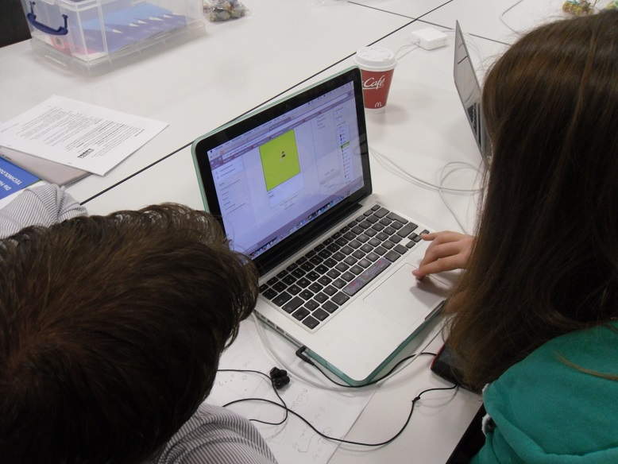
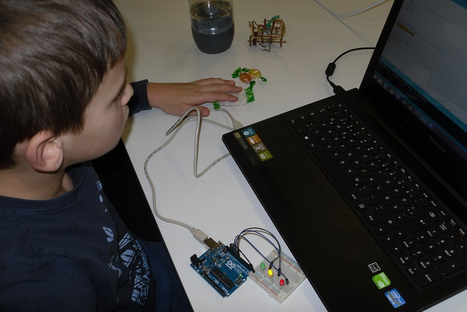

Programmieren, Basteln, Spaß – Das Coder Dojo Potsdam
=====================================================

Coder Dojos sind Klubs für Kinder, Jugendliche und Schüler um Programmieren zu lernen und Spaß zu haben. Diesmal entwickelten die Teilnehmer Oberflächenprogramme mit der Programmiersprache Python, Apps für Smartphones und erstellten Schaltungen und Steuerungen für Ampeln.

Am 6. Dezember fand das Coder Dojo zum sechten Mal am Hasso-Plattner-Institut statt. Es gibt heißen Tee und Bobons und – viel wichtiger – es gibt andere Menschen, die sich für das Programmieren interessieren. Nach dem das [Material](http://zen.coderdojo.com/dojo/861) vorgestellt wurde, wird ausprobiert, was man sich für den Nachmittag als Projekt vornehmen möchte. Wer schonmal da war, hat oft schon ein Projekt oder weiß, was er will. 

So beschäftigen sich zwei Absolventen des [Python-Online-Kurses](https://open.hpi.de/courses/pythonjunior2014) mit der Entwicklung von Oberflächen. Die eine Oberfläche ist für ein Spiel, Schere-Stein-Papier, das man gegen den Computer spielt. Die andere Oberfläche quadriert Zahlen. Beides verlangt umdenken – wo früher das Konsolenprogramm auf den Nutzer gewartet hat, muss der Programmfluss jetzt ein Funktionen zerstückelt und die Kontrolle an die Oberfläche weitergereicht werden. 

Wie lange hält das gelbe Licht einer Ampel auf einer 70km/h Strecke? Autofahrer wissen es, können es aber nicht sagen. Eine Schaltung braucht aber exakte Werte. Zehn Sekunden ist Rot, dann wird Gelb-Rot, dann Grün und dann 5 Sekunden wieder Gelb. Alles selbst gebaut und programmiert – eine reife Leistung für das erste Mal selbstständig [Arduino](http://arduino.cc/en/Main/ArduinoBoardUno)-Programmieren. 

Wer braucht es nicht – einen Selbstzerstörungsknopf für das Smartphone, wenn man es wieder nicht leiden kann. Nach dem Knopfdruck kann man hören, wie sich das mobile Endgerät innnerlich zerstört. Ein Bumm kommt aus dem Lautsprecher. Alternativ kann man sich auch vom Smartphone begrüßen lassen und ein Foto aufnehmen. Das wurde mit [App-Inventor](http://appinventor.mit.edu/) programmiert.

Unter dem Tisch summt ein kleiner [Holzroboter](https://github.com/niccokunzmann/rustyrobots/tree/master/john) über den Boden. Dass er sich ein Rad bricht, ist nicht schlimm. Man kann es wieder ausdrucken. Wenn er die nötigen Sensoren und eine aufwändige Programmierung bekommt, fährt er nicht mehr überall davor.

Während sich die Schüler mit ihren Projekten beschäftigen und austauschten, halfen die  vier Mentoren bei Problemen und standen mit Rat und Tat zur Seite. Das ist sehr wichtig, da eine Programmiersprache zu lernen sehr frustrierend sein kann. Der Computer hat kaum Tolleranz und antwortet nur mit Fehlermeldungen in seiner Spache. Deswegen den Mentoren  an dieser Stelle großen Dank! Ohne sie wäre ein so vielfältiges Dojo unmöglich.

Einer der Mentoren war [Dimitrij](https://twitter.com/aleshkov) vom [Coder Dojo Helsingborg in Schweden](http://www.creativelab.nu/coderdojo/). Auf Englisch konnte er gut mentorieren. Einer der Teilnehmer konnte Dänisch. So unterschiedlich sind die Sprachen nicht, wie sich herausstellte.

Die [nächsten Termine](http://www.eventbrite.de/o/coder-dojo-potsdam-6787334071) stehen schon fest und wir hoffen, dass wieder so viele Mentoren und Teilnehmer kommen. 
