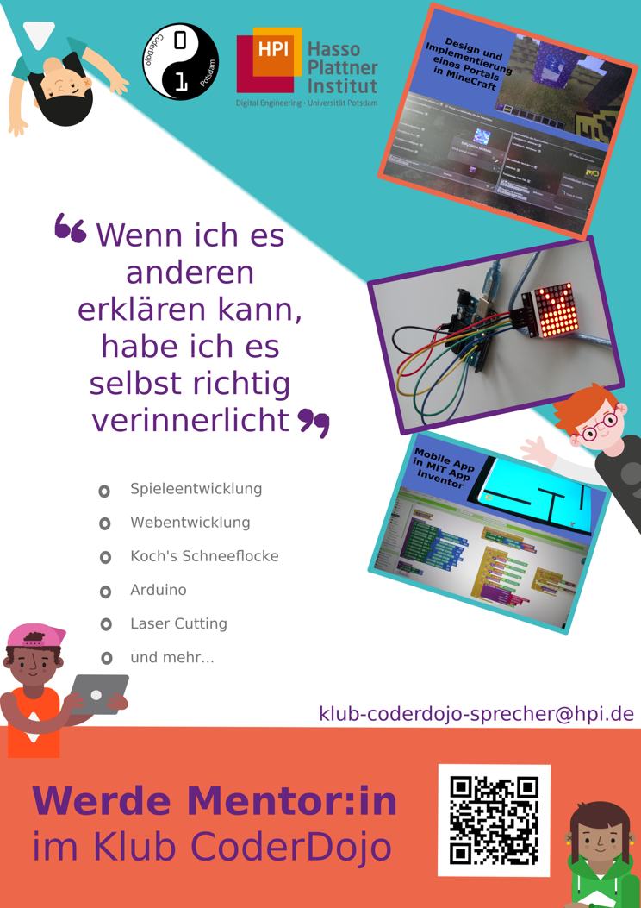
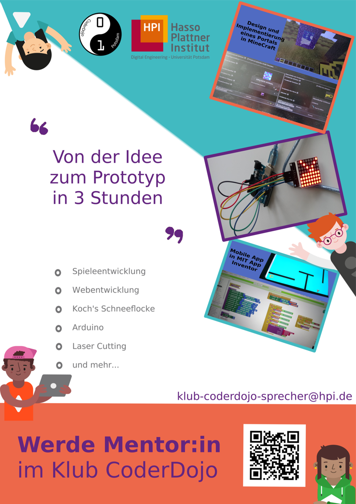
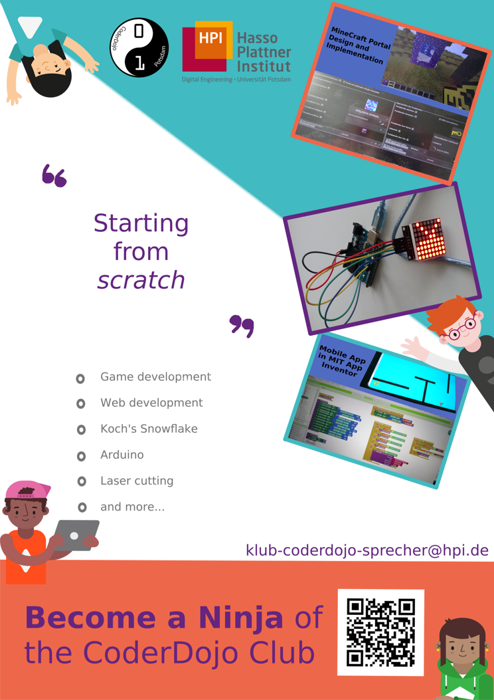

# Poster Werbung Mentoring am CoderDojo Potsdam

Diese Poster sind entstanden um neue Mentor:innen für das CoderDojo anzuwerben.

Die Masterdatei enthält alle Posterbausteine, separiert in Layern. Es wurden bisher zwei deutschsprachige und eine englischsprachige Postervariante erstellt.

  

Update 2026: die Masterdatei wurde um Layer erweitert, sodass auch Infoposter für Schulen erstellt werden können. Diese Richten sich eher an Schüler:innen als Teilnehmende, nicht explizit als Mentor:innen.
